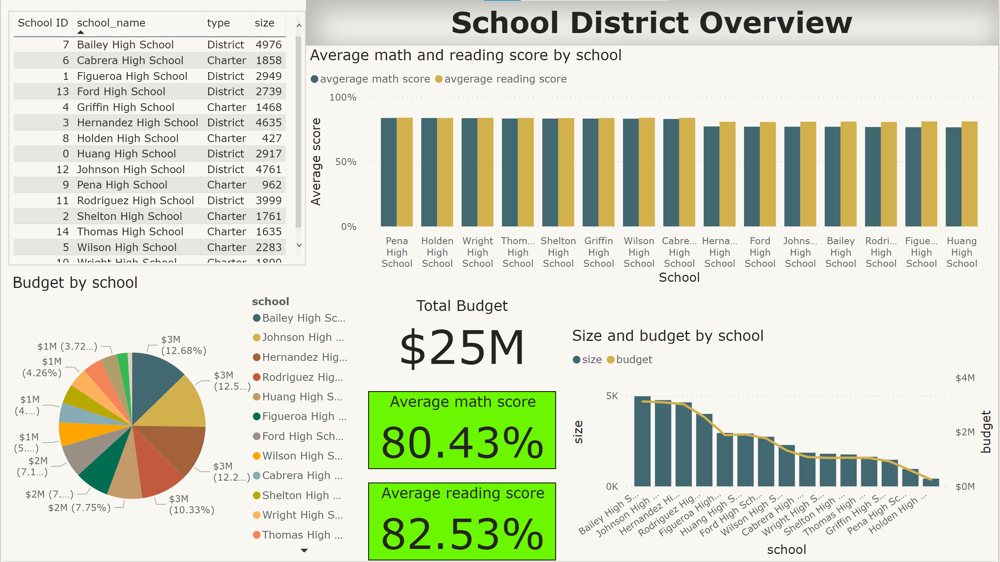
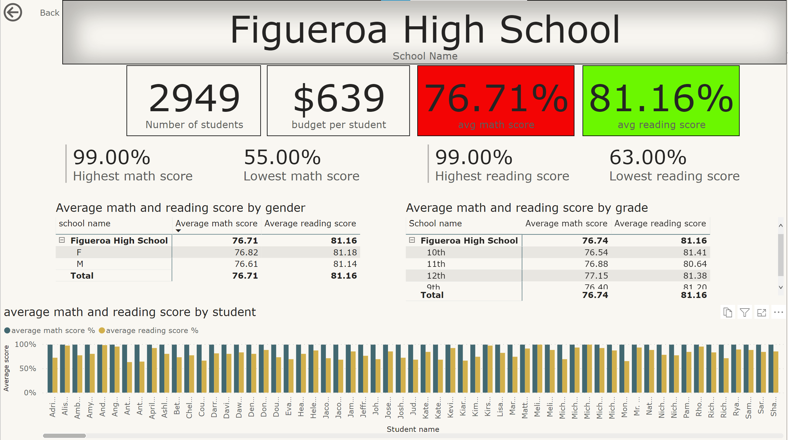

# PyCiySchools Disctrict Analysis

The [PyCitySchools](./PyCitySchools_starter.ipynb) contains analysis of the district-wide standardized test results and budget information. the [school and student csv's](./Resources) contain every student's math and reading scores, as well as various information on the schools they attend. The notebook previously mentioned contains the aggregation of the data using python to showcase obvious trends in school performance.

The report in the notebook will display the below  data

## District Summary

### High level snapshot of the district's key metrics, including:

* Total Schools
* Total Students
* Total Budget
* Average Math Score
* Average Reading Score
* % Passing Math (The percentage of students that passed math.)
* % Passing Reading (The percentage of students that passed reading.)
* % Overall Passing (The percentage of students that passed math and reading.)

## School Summary

### Overview table that summarizes key metrics about each school, including:

* School Name
* School Type
* Total Students
* Total School Budget
* Per Student Budget
* Average Math Score
* Average Reading Score
* % Passing Math (The percentage of students that passed math.)
* % Passing Reading (The percentage of students that passed reading.)
* % Overall Passing (The percentage of students that passed math and reading.)

## Top Performing Schools (By % Overall Passing)

### Table that highlights the top 5 performing schools based on % Overall Passing. Including:

* School Name
* School Type
* Total Students
* Total School Budget
* Per Student Budget
* Average Math Score
* Average Reading Score
* % Passing Math (The percentage of students that passed math.)
* % Passing Reading (The percentage of students that passed reading.)
* % Overall Passing (The percentage of students that passed math and reading.)

## Bottom Performing Schools (By % Overall Passing)

### Table that highlights the bottom 5 performing schools based on % Overall Passing. Includes all of the same metrics as above.

## Math Scores by Grade

### Table that lists the average Math Score for students of each grade level (9th, 10th, 11th, 12th) at each school.

## Reading Scores by Grade

### Table that lists the average Reading Score for students of each grade level (9th, 10th, 11th, 12th) at each school.

## Scores by School Spending

### Table that breaks down school performances based on average Spending Ranges (Per Student). Use 4 reasonable bins to group school spending. Includes each of the following:

* Average Math Score
* Average Reading Score
* % Passing Math (The percentage of students that passed math.)
* % Passing Reading (The percentage of students that passed reading.)
* % Overall Passing (The percentage of students that passed math and reading.)

## Scores by School Size

### Includes the above breakdown, but the schools are grouped based on an approximation of school size (Small, Medium, Large).

## Scores by School Type

### Includes the above breakdown, but the schools are grouped based on school type (Charter vs. District).

## District and school summary Power BI dashboard

### The [PyCitySchools pbix](./PyCitySchools.pbix) file contains a dashboard of the aggregating data as a Power BI dashboard

The first page conains an overall District analysis that lists all of the schools in the district, the average math and reading scores by school (with two cards that will highlight green if the average is greater than or equal to 80% and red if the score is less than 80%),Pie graph showing each school and the percentage of total district budget, a card showing total district budget and each school budget once selected, and a bar with line graph showing budget per school size.

You can then drill down on each of the schools individually which will take you to the school analysis dashboard. This dashboard contains the school size, budget per student, average reading and math score for the scool, highest and lowest math and reading scores, average math and reading scores by gender and by grade and a bar chart showing each students math and reading score.

